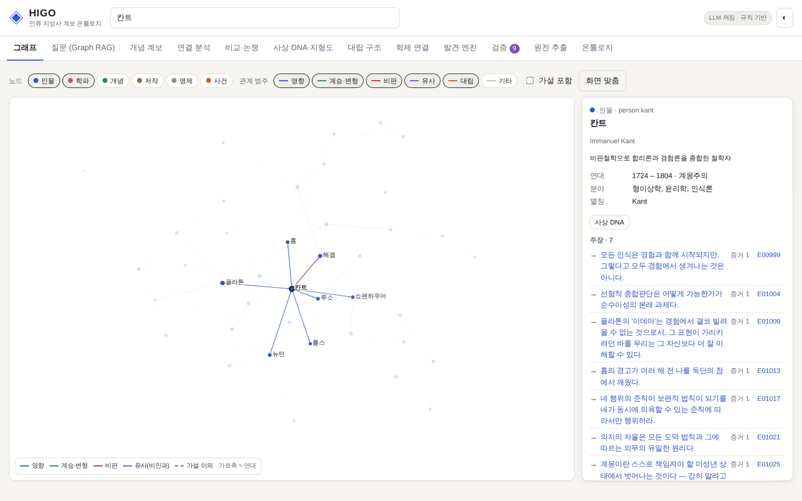
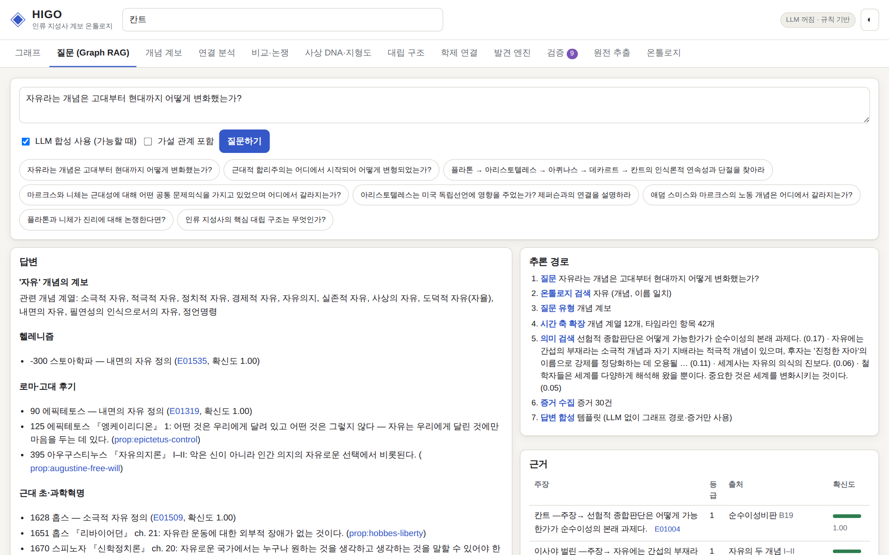
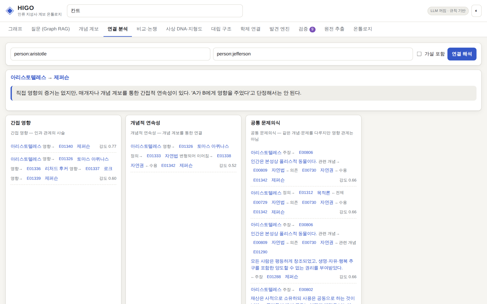
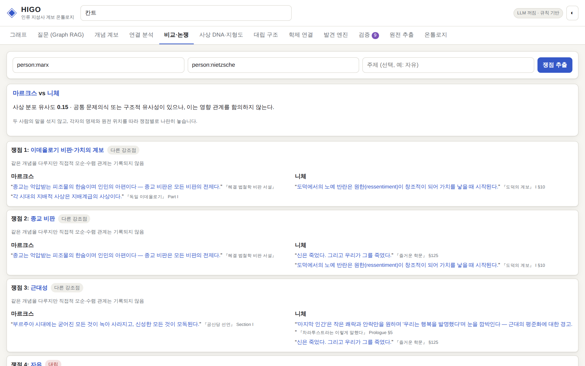
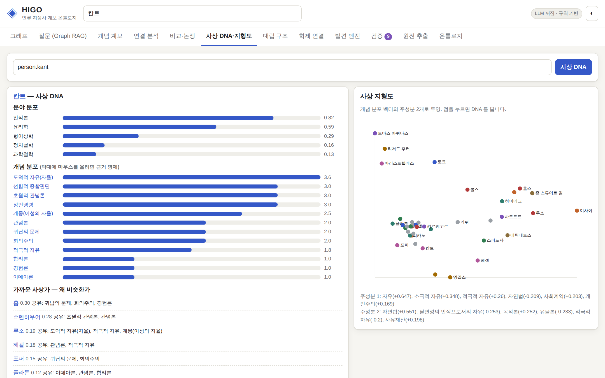
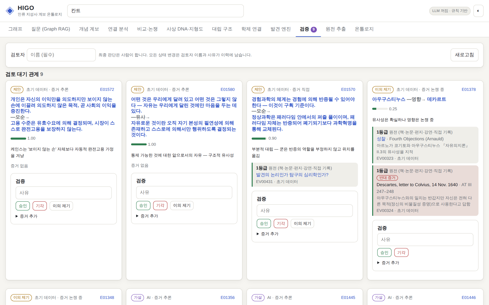

# HIGO — Human Intellectual Genealogy Ontology

인류 지성사를 **인물 → 저작 → 개념 → 명제 → 근거 → 영향 → 반론 → 계승·변형 → 시대·맥락**의 관계망으로
표현하는 지식 온톨로지 시스템입니다. 인물 그래프가 아니라 **사상 그래프**이며, 모든 중요한 관계는
증거 번들(Evidence Bundle)과 확신도, 인식론적 상태(가설 → 승인/이의/수정/기각)를 가집니다.

> 핵심 질문은 "플라톤은 누구인가?"가 아니라
> **"인간은 무엇을 진리라고 생각해 왔으며, 그 생각은 어떤 경로를 통해 변화해 왔는가?"** 입니다.

## 실행 화면

| 그래프 탐색 | 질문 (Graph RAG) |
|---|---|
|  |  |
| **연결 분석** — 아리스토텔레스 → 제퍼슨 | **비교·논쟁** — 마르크스 vs 니체 |
|  |  |
| **사상 DNA·지형도** — 칸트 | **검증 대기열** |
|  |  |

## 빠른 시작

외부 의존성 없이 Python 3.10+ 표준 라이브러리만으로 동작합니다.

```bash
cd higo
python -m higo serve            # http://127.0.0.1:8180 — data/ 의 온톨로지를 적재 (UI 에서의 검토는 data/ 에 저장)
python -m unittest discover -s tests
```

Claude 로 답변 합성·원전 추출을 하려면 (선택):

```bash
pip install anthropic
export ANTHROPIC_API_KEY=...     # HIGO_MODEL 로 모델 변경 가능 (기본 claude-opus-5)
```

LLM 이 없으면 Graph RAG 는 그래프 경로와 증거만으로 템플릿 답변을 만들고, 추출은 규칙 기반으로 동작합니다.
`HIGO_LLM=off` 로 강제로 끌 수 있습니다.

## 시스템 구조

```
Primary Sources ─→ Document Pipeline ─→ AI Extraction ─→ 후보 큐(candidates)
                                                              │  사람이 채택
                                                              ▼
                  Ontology Layer (ontology.py: 13 엔티티 · 42 관계 · 6 증거 Tier · 6 인식 상태)
                                                              │
                 Knowledge Graph (store.py/graph.py) + Evidence Graph (evidence 테이블)
                                                              │
                     Reasoning Engine (reasoning.py) ── Vector Index (vector.py)
                                                              │
                     Discovery Engine (discovery.py) → Hypothesis Edge (Tier 6)
                                                              │
                     Human Validation (validation.py Reviewer) → Living Ontology (history · versions)
                                                              │
                     Graph RAG (rag.py) · HTTP API (server.py) · Web UI (web/) · CLI (cli.py)
```

| 모듈 | 역할 |
|---|---|
| `ontology.py` | 스키마. 엔티티 타입, 관계 타입(범주·domain/range·증거 필수 여부·시간 순서), 증거 위계, 인식 상태와 허용 전이 |
| `store.py` | SQLite 저장소. 엔티티·관계·증거·변경 이력·문서·추출 후보·온톨로지 버전 |
| `confidence.py` | 증거 → 확신도. `noisy-OR(지지) × 증거성격 계수 × (1 − 0.6·noisy-OR(반대))` |
| `validation.py` | domain/range, 증거 요구, 시대착오(anachronism), AI 관계의 무검토 승인 차단, 상태 전이 게이트 |
| `graph.py` | 인메모리 그래프 인덱스 (Store revision 이 바뀌면 자동 재구성) |
| `reasoning.py` | 연결 해석, 개념 계보, 대립 구조, 학제 연결, 사상 DNA, 지형도(PCA), 사상가 비교 |
| `discovery.py` | 의미 유사성·전이적 영향·개념 동시출현·학제 교량·잠재 모순 발견 → 가설로만 기록 |
| `extraction.py` | 문장 분할, 가제티어 엔티티 링크, 관계·명제·신규 개념 후보 추출 (+ 선택적 Claude 추출) |
| `vector.py` | 의존성 없는 TF-IDF(단어 + 한글 bigram) 벡터 인덱스. `Embedder` 교체로 실제 임베딩/Vector DB 연결 |
| `rag.py` | Graph RAG: 엔티티 링크 → 의도 판별 → 그래프 확장 → 명제·증거 수집 → 합성, 인용 ID 검증 |
| `export.py` | JSON 스냅샷/가져오기, Neo4j Cypher, RDF/Turtle(OWL 스키마 + 증거가 붙은 reification) |

## 설계 원칙이 코드에서 어떻게 지켜지는가

**영향과 유사성은 절대 섞지 않는다.** 관계는 `influence / succession / critique`(인과)와
`similarity / opposition`(비인과) 범주로 나뉩니다. 예를 들어 seed 에는

- `플라톤 ──influenced──→ 칸트` (evidence_status=indirect, 『순수이성비판』 A313/B370 + 2차 문헌)
- `플라톤 ──similar_to──→ 칸트` (구조적 유사성, 영향을 함의하지 않음)

가 **별개의 관계**로 존재하고, 추론 엔진은 유사성 경로를 영향으로 분류하지 않습니다.

**연결을 다섯 가지 이상으로 구분해 제시한다.** `explain_connection(A, B)` 는 두 노드 사이 경로를
지적 흐름의 방향과 관계 범주로 분류합니다.

```
DIRECT_INFLUENCE · INDIRECT_INFLUENCE · CONCEPTUAL_CONTINUITY · CRITICAL_ENGAGEMENT
SHARED_PROBLEM · STRUCTURAL_SIMILARITY · CONCEPTUAL_OPPOSITION · HISTORICAL_CO_OCCURRENCE
```

`아리스토텔레스 → 제퍼슨`을 물으면 "직접 영향의 증거는 없지만 매개자나 개념 계보를 통한 간접적 연속성이 있다"고
판정하고, 경로(아리스토텔레스 → 아퀴나스 → 후커 → 로크 → 제퍼슨, 자연법 → 자연권)와 각 관계의 증거를 보여줍니다.

**AI = Discovery Engine, Human = Epistemic Authority.** 추출·발견 결과는 `hypothesis` 상태 + Tier 6 증거로만
기록됩니다. 상태 전이는 사람 검토자 이름 없이는 불가능하며(`ai:`/`system` 행위자 거부), 증거가 필요한
관계는 증거 없이 승인할 수 없습니다. seed 에는 검토 큐 시연을 위해 의도적으로 넣은 AI 가설
(예: `플라톤 → 스미스` 영향 — 유사성에서 추론된, 기각되어야 할 가설)과 학계 논쟁 중인 관계
(`홉스 → 로크`, `아우구스티누스 → 데카르트` — 지지·반대 증거가 함께 붙은 contested)가 들어 있습니다.

**Living Ontology.** 모든 생성·수정·확신도 변화·검토는 `history` 에 남고(`E00182 confidence 0.72 → 0.91` 같은
변화 추적), `snapshot_version` 으로 온톨로지 버전을 기록합니다.

## Phase 1 seed

`higo/seed/` — 철학자 30인(소크라테스 ~ 롤스)과 교차 분야 인물(뉴턴, 아인슈타인, 스미스, 리카도, 케인스,
하이에크, 밀, 벌린, 후커, 제퍼슨, 엥겔스), 원전 95편, 개념 약 115개(‘자유’는 소극적·적극적·정치적·경제적·
도덕적·형이상학적·실존적·사상의 자유 등으로 분화), 명제 약 130개(표준 인용 위치 포함), 증거 440여 건.

- 명제는 원문 인용이 아니라 해당 대목의 **요지(paraphrase)** 이며 `certainty: paraphrase` 로 표시됩니다.
  원문 인용은 검토자가 원전을 확인해 증거의 `quotation` 에 붙이도록 비워 두었습니다.
- Tier 3~4 증거(2차 문헌·백과사전)는 서지를 명시했지만 쪽수는 비어 있는 경우가 많습니다. 이 데이터는
  온톨로지가 제대로 작동하는지 검증하기 위한 초기 큐레이션이며, 전문 연구자의 검토를 전제로 합니다.

## 검증 질문

Web UI 의 "질문" 탭 또는 CLI 로 바로 실행할 수 있습니다 (테스트에도 포함).

```bash
python -m higo ask "자유라는 개념은 고대부터 현대까지 어떻게 변화했는가?"
python -m higo ask "근대적 합리주의는 어디에서 시작되어 어떻게 변형되었는가?"
python -m higo ask "플라톤 → 아리스토텔레스 → 아퀴나스 → 데카르트 → 칸트의 인식론적 연속성과 단절을 찾아라"
python -m higo ask "마르크스와 니체는 근대성에 대해 어떤 공통 문제의식을 가지고 있었으며 어디에서 갈라지는가?"
python -m higo ask "동일한 개념이 철학·경제학·정치학에서 어떻게 다른 의미로 변형되었는가?"
```

## CLI

```bash
python -m higo --db higo.db init
python -m higo connect person:aristotle person:jefferson
python -m higo genealogy concept:freedom
python -m higo compare person:smith person:marx --topic 노동
python -m higo dna person:kant
python -m higo landscape | contradictions | cross-domain
python -m higo discover [--commit]
python -m higo queue
python -m higo review E00123 approve --actor 홍길동 --reason "원전 확인"
python -m higo evidence E00123 --tier 1 --source work:prolegomena --locator "4:260"
python -m higo ingest text.txt --title "..." --author person:hegel [--llm]
python -m higo validate | stats | history E00123
python -m higo snapshot 0.2.0 --note "Phase 2: 정치·경제 확장"
python -m higo export cypher > higo.cypher      # Neo4j/Memgraph
python -m higo export turtle > higo.ttl         # 트리플스토어
```

## HTTP API (요약)

| 메서드 | 경로 | 설명 |
|---|---|---|
| GET | `/api/schema`, `/api/stats`, `/api/validate` | 스키마·현황·감사 |
| GET | `/api/graph?types=Person,Concept&status=all` | 시각화용 그래프 |
| GET | `/api/entities/{id}`, `/api/edges/{id}` | 상세(관계·증거·이력·검증) |
| GET | `/api/connection?a=&b=` | 연결 해석 |
| GET | `/api/genealogy/{concept}` | 개념 계보 |
| GET | `/api/compare?a=&b=&topic=` | 쟁점별 비교 |
| GET | `/api/dna/{person}`, `/api/landscape` | 사상 DNA · 지형도 |
| GET | `/api/contradictions`, `/api/cross-domain` | 대립 구조 · 학제 연결 |
| POST | `/api/ask` | Graph RAG |
| POST | `/api/discover`, `/api/discover/commit` | 발견 · 가설 기록 |
| POST | `/api/edges`, `/api/edges/{id}/evidence`, `/api/edges/{id}/review` | 관계 등록 · 증거 · 검증 |
| POST | `/api/extract`, `/api/candidates/{id}/approve` | 원전 추출 · 후보 채택 |
| GET | `/api/export/{json,cypher,turtle}` | 내보내기 |

## 자동 갱신 (Claude 가 스스로 넓히고 사람은 승인만)

온톨로지의 원본은 `data/` 의 텍스트 파일입니다. Claude 가 제안한 변경은 **인용문 원문 대조 → 위험도 정책 →
등급별 반영**을 거쳐 주기별 보고서(`data/runs/`)로 올라오고, 사람은 PR 과 웹 UI 의 **자동 갱신** 탭에서 확인·승인합니다.
자세한 내용은 [`docs/AUTONOMY.md`](docs/AUTONOMY.md) 를 보세요.

```bash
python -m higo cycle --changeset examples/changeset.example.json --dry-run
python -m higo gaps
python -m higo bench
```

## 확장 로드맵

1. **Phase 2 — 정치·경제**: seed 모듈을 추가하는 것만으로 확장 (스키마 변경 불필요)
2. **Graph DB / Vector DB 전환**: `export.to_cypher` 로 Neo4j 적재, `vector.Embedder` 를 실제 임베딩 +
   Qdrant/Weaviate 로 교체
3. **원전 코퍼스 파이프라인**: 공개 원전 텍스트를 `ingest` → 후보 검토 → 명제·증거 축적
4. **MSC 학습 온톨로지와의 연결**: HIGO 의 개념·명제 노드를 학습자의 이해·연결·추론 기록과 매핑해,
   "지식의 구조"와 "학습자의 사고 구조"를 함께 모델링
